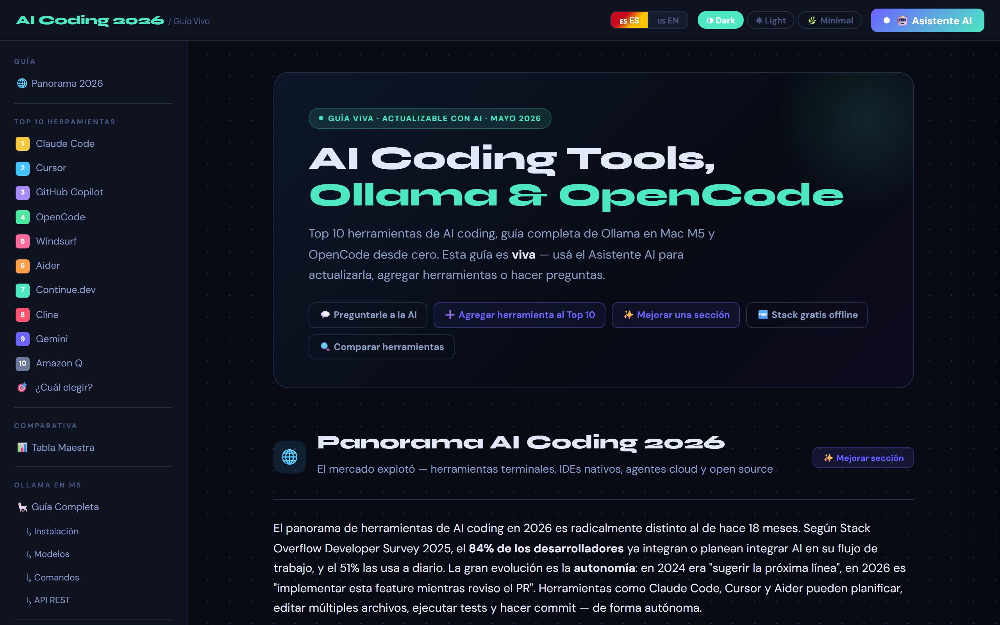
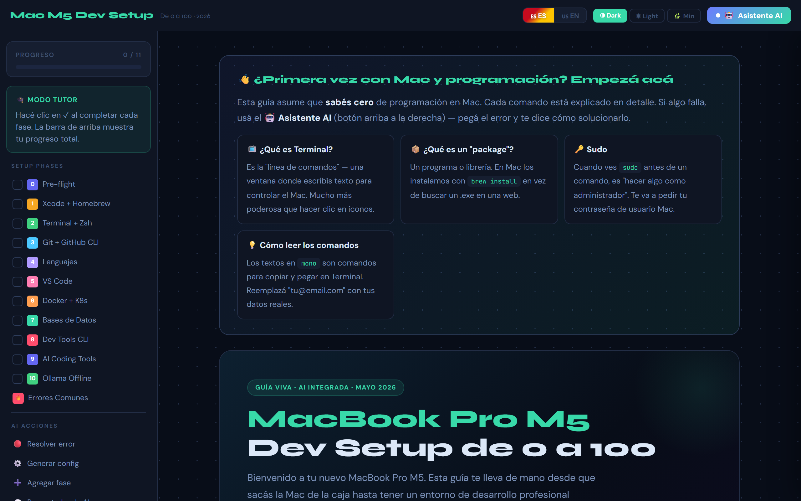
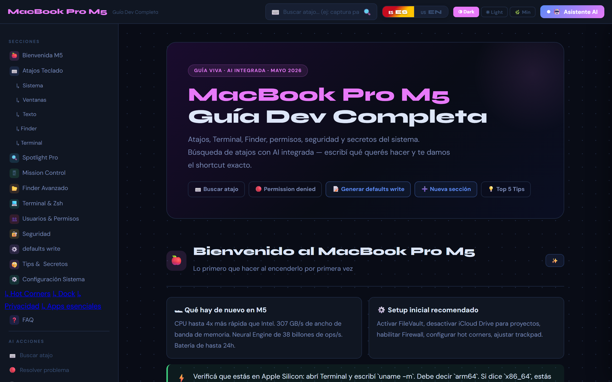
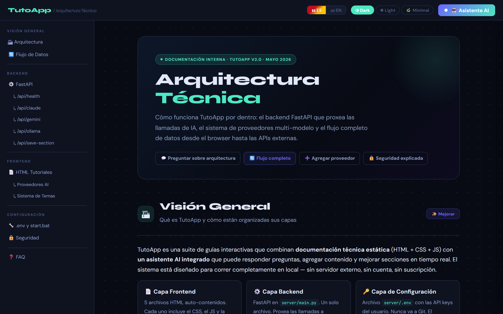

# 🧠 TutoApp — Guías interactivas con IA integrada

> **Aprendé tecnología de verdad. Con IA. Sin fricción. Sin instalar nada raro.**

[](https://python.org)
[](https://fastapi.tiangolo.com)
[](https://puter.com)
[](LICENSE)

---

## 🖼️ Vista previa

<table>
  <tr>
    <td align="center"><strong>AI Coding Tools 2026</strong></td>
    <td align="center"><strong>Dev Setup Mac M5</strong></td>
  </tr>
  <tr>
    <td></td>
    <td></td>
  </tr>
  <tr>
    <td align="center"><strong>MacBook Pro M5</strong></td>
    <td align="center"><strong>Arquitectura Técnica</strong></td>
  </tr>
  <tr>
    <td></td>
    <td></td>
  </tr>
</table>

---

## ¿Qué es TutoApp?

TutoApp es una colección de **guías técnicas interactivas** que tienen un asistente de IA integrado adentro. No es un chatbot genérico. Cada guía sabe exactamente de qué trata, puede responderte preguntas contextuales, y te permite guardar notas con mejoras generadas por IA sobre cada sección.

Abrís la guía. Leés. Preguntás. La IA te responde en contexto. Guardás las mejoras. Listo.

---

## 📦 La filosofía: Todo vive dentro del HTML

> *"Un framework de 800MB para servir texto con colores es un problema de identidad, no una solución."*

Cada guía de TutoApp es **un único archivo `.html`**. Eso es todo. Adentro vive el contenido, los estilos, el JavaScript, la lógica del asistente de IA, el sistema de notas, y el switch de idioma.

**¿Por qué?** Tres razones reales:

**1. Portabilidad absoluta.**
Un HTML es como un libro: lo abrís y funciona. No depende de que `node_modules/` esté instalado, no falla porque alguien borró un paquete, no necesita que el CI pase. Si tenés el archivo, tenés la guía completa.

**2. El HTML es el deploy.**
No hay paso de build. No hay Webpack, Vite, ni Babel. El archivo que editás es el mismo que el usuario ve. Esto hace que contribuir sea instantáneo: abrís el HTML en un editor, hacés el cambio, recargás el browser. Sin fricción de ningún tipo.

**3. Durabilidad real.**
Los frameworks mueren. Las dependencias se abandonan. El HTML de 2026 va a funcionar en 2036 igual. Es el formato más estable de la web. Un `<h1>` de hace 30 años sigue siendo un `<h1>` hoy.

> El servidor FastAPI existe por una única razón: persiste las mejoras de IA que vas guardando en cada sección. El HTML es el cerebro; el servidor es solo la memoria.

---

## 📚 Las 5 guías incluidas

| # | Guía | ¿Qué vas a aprender? |
|---|------|----------------------|
| 1 | **🤖 AI Coding Tools 2026** | Las mejores herramientas de IA para devs, comparativas reales, cómo usar Ollama en local para no depender de APIs |
| 2 | **🍎 Dev Setup Mac M5** | Setup completo de desarrollo en Mac M5: Homebrew, Docker, Python, PostgreSQL, Node, todo desde cero |
| 3 | **💻 MacBook Pro M5** | Atajos de teclado, Terminal avanzada, trucos de seguridad, y los tips que nadie te cuenta hasta que ya perdiste tiempo |
| 4 | **🎓 Tutorial Mac 2026** | Guía actualizada de macOS para devs: gestión de ventanas, automatización, flujos de trabajo eficientes |
| 5 | **🏗️ Arquitectura Técnica** | Patrones de diseño, decisiones arquitectónicas, cómo pensar sistemas que escalen sin volverse locos |

Cada guía tiene:
- ✅ Contenido técnico profundo organizado por secciones
- 🌐 Switch **ES / EN** para leer en el idioma que prefieras
- 💬 Asistente de IA contextual (sabe de qué trata esa guía)
- 💡 Sistema de mejoras: pedile a la IA que mejore cualquier sección
- 💾 Guardado persistente de mejoras en el servidor local

---

## 🚀 Cómo instalar y ejecutar

### Requisitos mínimos

| Herramienta | Versión mínima | ¿Dónde conseguirla? |
|-------------|----------------|---------------------|
| **Python** | 3.11 o superior | [python.org/downloads](https://www.python.org/downloads/) |
| **Git** | cualquiera | [git-scm.com](https://git-scm.com/downloads) |

> **Windows**: al instalar Python, tildá **"Add Python to PATH"** — si no lo hacés, nada funciona y no vas a entender por qué.

---

### Paso 1 — Clonar el repositorio

```bash
git clone https://github.com/aramendyLucky/tutoapp.git
cd tutoapp
```

---

### Paso 2 — Arrancar la app

#### 🪟 Windows

Doble clic en `start.bat`, o desde PowerShell:

```powershell
.\start.bat
```

#### 🍎 Mac / Linux

```bash
chmod +x start.sh   # Solo la primera vez — le da permiso de ejecución
./start.sh
```

---

### ¿Qué hace el script por vos?

El script es completamente automático. No necesitás hacer nada más:

```
🔍 Verificando Python...           ✅ Python 3.12 encontrado
📦 Creando entorno virtual...      ✅ .venv/ creado (solo la primera vez)
⚡ Instalando dependencias...      ✅ FastAPI + Uvicorn instalados
🚀 Arrancando servidor...          ✅ http://localhost:8000 activo
🌐 Abriendo browser...             ✅ Tu guía está lista
```

La primera vez tarda ~30 segundos en crear el entorno virtual. Las siguientes veces arranca en menos de 3 segundos.

---

### Paso 3 — Elegir una guía

Una vez que el servidor está corriendo, podés acceder a cualquier guía:

| URL | Guía |
|-----|------|
| `http://localhost:8000/ai-coding-tools` | AI Coding Tools 2026 |
| `http://localhost:8000/dev-setup-mac-m5` | Dev Setup Mac M5 |
| `http://localhost:8000/macbook-pro-m5-guia` | MacBook Pro M5 |
| `http://localhost:8000/tutorial_mac_2026` | Tutorial Mac 2026 |
| `http://localhost:8000/arquitectura-tecnica` | Arquitectura Técnica |

---

## 🤖 Cómo funciona el asistente de IA

### Modo gratuito — Puter.js (por defecto)

Sin configurar absolutamente nada, el asistente usa **[Puter.js](https://puter.com)** — una librería de IA que corre en el browser sin API keys, sin cuentas, sin pagos.

Abrís la guía y el chat ya funciona. Gratis. Para siempre.

---

### Modo avanzado — Claude o Gemini con tu propia API key

Si querés respuestas más potentes, podés conectar Claude (Anthropic) o Gemini (Google). Editá el archivo `server/.env`:

```env
# Conseguís tu key en: https://console.anthropic.com
ANTHROPIC_API_KEY=sk-ant-...

# Conseguís tu key en: https://aistudio.google.com
GEMINI_API_KEY=AI...
```

El archivo `.env.example` ya está incluido como plantilla. Solo copialo y completá tus keys:

```bash
cp server/.env.example server/.env
# Editá server/.env con tu editor favorito
```

> **El `.env` nunca sube a GitHub** — está en el `.gitignore`. Tus keys son tuyas.

---

## 💡 Sistema de mejoras con IA

Esta es la funcionalidad estrella de TutoApp.

Cada sección de cada guía tiene un botón **"Mejorar con IA"**. Al hacerle clic:

1. La IA analiza el contenido actual de esa sección
2. Genera una versión mejorada, más clara, más actualizada, con ejemplos
3. Podés **previsualizar** la mejora antes de aceptarla
4. Si la aceptás, se **guarda en el servidor** (en `server/.env` o en memoria)
5. La próxima vez que abras la guía, la sección ya muestra la versión mejorada

```
Usuario → [Mejorar esta sección]
   ↓
Puter.js / Claude / Gemini → genera mejora en contexto
   ↓
Browser → muestra preview con diff
   ↓
Usuario → [Guardar] → POST /api/save-section
   ↓
FastAPI → persiste la mejora en el servidor
   ↓
Próxima visita → la sección carga ya mejorada ✅
```

> Las mejoras son **acumulativas y persistentes**. Cada vez que usés la app, las guías se vuelven más útiles para vos.

---

## 🗂 Estructura del proyecto

```
tutoapp/
│
├── client/                         ← Las 5 guías HTML (autocontenidas)
│   ├── ai-coding-tools.html        ← Guía 1: Herramientas de IA
│   ├── dev-setup-mac-m5.html       ← Guía 2: Setup dev en Mac M5
│   ├── macbook-pro-m5-guia.html    ← Guía 3: Tips MacBook Pro M5
│   ├── tutorial_mac_2026.html      ← Guía 4: Tutorial Mac 2026
│   └── arquitectura-tecnica.html   ← Guía 5: Arquitectura técnica
│
├── server/                         ← Backend Python (FastAPI)
│   ├── main.py                     ← Servidor y endpoints de la API
│   ├── requirements.txt            ← Dependencias Python
│   ├── .env.example                ← Plantilla de config (sin keys reales)
│   └── .env                        ← Tu config real (NO va a GitHub)
│
├── start.bat                       ← Lanzador Windows (doble clic y listo)
├── start.sh                        ← Lanzador Mac / Linux
└── README.md                       ← Este archivo
```

---

## 🔧 Solución de problemas comunes

<details>
<summary><strong>❌ "Python no encontrado" o "'python' is not recognized"</strong></summary>

**Causa:** Python no está en el PATH del sistema.

**Solución:**
1. Desinstalá Python
2. Volvé a instalarlo desde [python.org](https://www.python.org/downloads/)
3. Durante la instalación, **tildá "Add Python to PATH"** (primera pantalla)
4. Abrí una terminal nueva (importante: nueva, no la misma)
5. Verificá con `python --version`

</details>

<details>
<summary><strong>❌ "Puerto 8000 ocupado" o "Address already in use"</strong></summary>

**Causa:** Hay una instancia del servidor corriendo en background.

**Solución Windows:**
```powershell
netstat -ano | findstr :8000
taskkill /PID <el-PID-que-aparece> /F
```

**Solución Mac/Linux:**
```bash
lsof -ti:8000 | xargs kill -9
```

Después volvé a ejecutar el script normalmente.

</details>

<details>
<summary><strong>❌ Mac: "Permission denied" al ejecutar start.sh</strong></summary>

**Causa:** El archivo no tiene permiso de ejecución (normal en Mac cuando clonás un repo).

**Solución:**
```bash
chmod +x start.sh
./start.sh
```

</details>

<details>
<summary><strong>❌ El browser no se abre automáticamente</strong></summary>

**Causa:** Algunos entornos corporativos o configuraciones de seguridad bloquean la apertura automática de browsers.

**Solución:** Abrí manualmente tu browser y entrá a:
```
http://localhost:8000
```

</details>

<details>
<summary><strong>❌ La IA no responde / "Error de conexión"</strong></summary>

**Causa:** Puter.js necesita conexión a internet para funcionar.

**Verificá:**
- Que tenés conexión activa
- Que no hay un proxy o firewall corporativo bloqueando la conexión
- Si usás API keys propias, que sean válidas y tengan crédito

</details>

<details>
<summary><strong>❌ Las mejoras guardadas no aparecen al reabrir</strong></summary>

**Causa:** El servidor no está corriendo cuando abrís la guía.

**Solución:** Siempre accedé a las guías a través del servidor (`http://localhost:8000/...`), no abriendo el archivo HTML directo con doble clic. Si abrís el `.html` directo, las mejoras guardadas no se van a cargar porque no hay servidor que las sirva.

</details>

---

## 🛠 Tecnologías usadas

| Tecnología | Rol | Por qué se eligió |
|------------|-----|-------------------|
| **FastAPI** | Servidor backend | Rápido, moderno, tipado, async-first |
| **Uvicorn** | Servidor ASGI | El más eficiente para FastAPI |
| **Puter.js** | IA gratuita en browser | Zero config, zero costo, funciona ya |
| **HTML + CSS + JS** | Las guías en sí | Portables, durables, sin build step |
| **Python-dotenv** | Config con `.env` | Estándar de la industria para secrets |

---

## 🤝 Contribuir

¿Encontraste algo desactualizado? ¿Querés agregar una guía nueva? Las contribuciones son bienvenidas.

1. Forkiá el repo
2. Creá una rama: `git checkout -b feat/mi-mejora`
3. Hacé tus cambios en el HTML correspondiente
4. Committeá: `git commit -m "feat: descripción de la mejora"`
5. Abrí un Pull Request

> **Tip**: Si querés agregar una guía nueva, el camino más fácil es copiar un HTML existente como base y adaptar el contenido. Toda la lógica del asistente de IA ya está lista adentro.

---

## 📄 Licencia

MIT — hacé lo que quieras con esto. Si te sirve, estrellá el repo ⭐

---

<div align="center">
  <strong>Hecho con FastAPI + Puter.js + mucho ☕</strong><br>
  <sub>TutoApp — Porque aprender debería ser fácil, no una batalla contra el entorno</sub>
</div>
